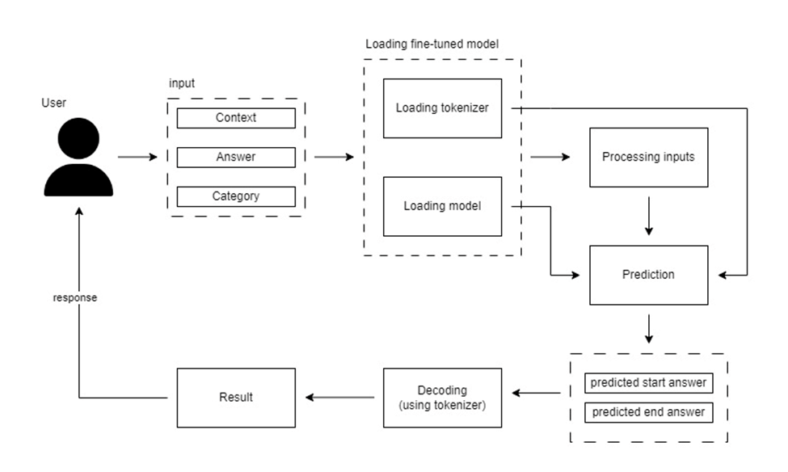
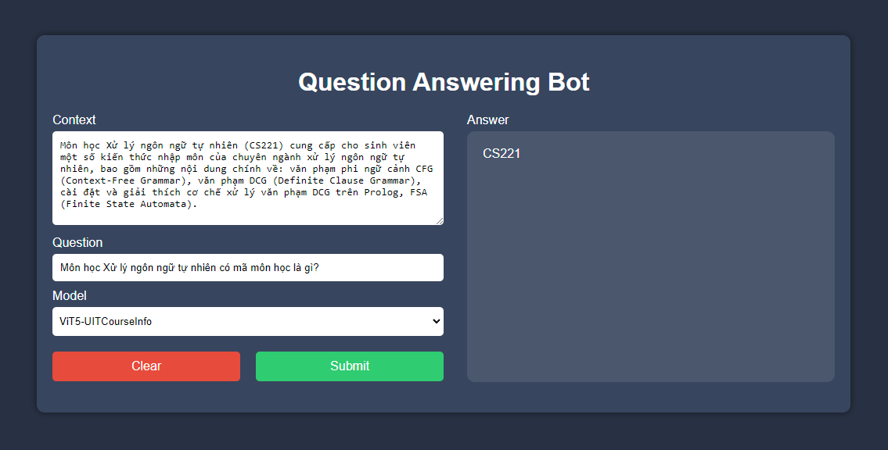
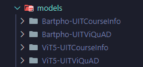
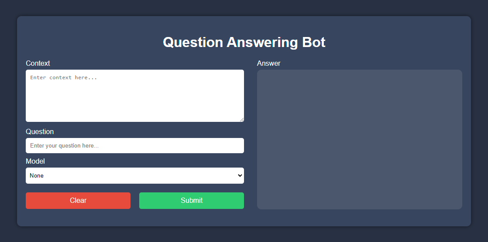

<!-- Banner -->
<p align="center">
  <a href="https://www.uit.edu.vn/" title="Trường Đại học Công nghệ Thông tin" style="border: none;">
    
  </a>
</p>
<!-- Title -->
<h1 align="center"><b>CS221.O22 - Natural language processing (NLP)</b></h1>

## COURSE INTRODUCTION
* **Course name:** Natural language processing (NLP)
* **Course ID:** CS221
* **Class ID:** CS221.O22
* **Year:** HK2 (2023 - 2024)

## LECTURER
* **TS.Nguyễn Trọng Chỉnh** - *chinhnt@uit.edu.vn*
* **THS. Đặng Văn Thìn** - *thindv@uit.edu.vn*
* **Nguyễn Đức Vũ** - *vund@uit.edu.vn*

## PROJECT
- **Name**: Advanced Vietnamese Question Answering System for Specialized Domain Information.

## TEAM MEMBER
| Ordinal number | Name | ID |
| :---: | --- | --- |
| 1 | Ngô Phúc Danh | 21521924 |
| 2 | Nguyễn Huỳnh Minh Triết | 21520497 |
| 3 | Nguyễn Minh Thư | 21520472 |

# Advanced Vietnamese Question Answering System for Specialized Domain Information.
<a id="readme-top"></a>
<details>
  <summary>Table of Contents</summary>
  <ol>
    <li>
      <a href="#about-the-project">About The Project</a>
      <ul>
        <li><a href="#built-with">Built With</a></li>
      </ul>
    </li>
    <li>
      <a href="#getting-started">Getting Started</a>
      <ul>
        <li><a href="#prerequisites">Prerequisites</a></li>
        <li><a href="#installation">Installation</a></li>
      </ul>
    </li>
    <li><a href="#usage">Usage</a></li>
    <li><a href="#roadmap">Roadmap</a></li>
    <li><a href="#contributing">Contributing</a></li>
    <li><a href="#license">License</a></li>
    <li><a href="#contact">Contact</a></li>
    <li><a href="#acknowledgments">Acknowledgments</a></li>
  </ol>
</details>

<!-- ABOUT THE PROJECT -->
## About The Project

The Question Answering (QA) problem is an important field in Natural Language Processing (NLP), focusing on building systems capable of automatically answering questions posed by humans in natural language. This problem combines many fields such as machine learning, linguistic analysis, and information extraction. With the advancements in deep learning, especially through transformer models like BERT or GPT, the accuracy and efficiency of QA systems have significantly improved. However, the Question Answering problem still faces several challenges. One of the primary challenges is the requirement for the QA system to understand the context of the question and the source document (question & context).

The architecture:



For example, in the context sentence "Today the beach in Bình Định is very cool, the sunshine in Bình Định is very bright," and the question "Where is the sunshine very bright?" the QA system needs to understand that the answer is "Bình Định" from the second part of the context sentence, not the first occurrence of “Bình Định.”

Input:
* Context: A sentence or a short paragraph in Vietnamese
* Question: A Vietnamese question related to the content of the context.

Output:
* Answer: The start position and end position of the answer within the context from there get the answer

Example:



<p align="right">(<a href="#readme-top">back to top</a>)</p>


### Built With
* [![FastAPI][FastAPI.com]][FastAPI-url]
* [![HuggingFace][HuggingFace.co]][HuggingFace-url]
* [![PyTorch][PyTorch.org]][PyTorch-url]
* [![MongoDB][MongoDB.com]][MongoDB-url]

<p align="right">(<a href="#readme-top">back to top</a>)</p>


<!-- GETTING STARTED -->
## Getting Started

### Prerequisites
* **Python**
  Version 3.10.14
* **Anaconda**
  [Anaconda](https://www.anaconda.com/)
* **MongoDB**
  [MongoDB-url](https://www.mongodb.com/)
* **Data**
  Name | Data 
  ---|---
  UIT-ViSQuAD | [UIT-ViSQuAD](https://huggingface.co/datasets/taidng/UIT-ViQuAD2.0)
  UIT-CourseInfo | [UIT-CourseInfo](https://huggingface.co/datasets/PhucDanh/UIT-CourseInfo)
* **Models**
  Model | #params | Max length
  ---|---|---
  [`PhucDanh/Bartpho-UITViSQuAD`](https://huggingface.co/PhucDanh/Bartpho-fine-tuning-model-for-question-answering) | 396M | 1024
  [`PhucDanh/Bartpho-UITCourseInfo`](https://huggingface.co/PhucDanh/Bartpho-fine-tuning-on-UIT-Course-information) | 396M | 1024
  [`PhucDanh/ViT5-UITViSQuAD`](https://huggingface.co/PhucDanh/vit5-fine-tuning-for-question-answering) | 226M | 768
  [`PhucDanh/ViT5-UITCourseInfo`](https://huggingface.co/PhucDanh/ViT5-fine-tuning-on-UIT-Course-information) | 226M | 768
* **Settings** <br>
  Install the fine-tuned models above and place in folder named *Models*
  Remember to rename the model name <br>
  <br>
  Install the dataset above and place in folder named *data*<br>
  
* **Create env**
  ```
  conda create --name QASystem python=3.10.14
  ```
* **Activate env**
  ```
  conda activate QASystem
  ```

### Installation
1. Clone the repo
   ```sh
   git clone https://github.com/imhwy/ExtractiveQuestionAnsweringSystem.git
   ```
2. Update pip
    ```sh
    pip install --upgrade pip
    ```
3. Pytorch-gpu
   ```
   pip3 install torch torchvision torchaudio --index-url https://download.pytorch.org/whl/cu118
   ```
4. Install requirements
   ```sh
   pip install -r requirements.txt
   ```

<p align="right">(<a href="#readme-top">back to top</a>)</p>


<!-- USAGE EXAMPLES -->
## Usage
### Fine-tuning
Access to 
```ExtractiveQuestionAnsweringSystem/src/app/train```
to start tuning<br>
You can change the hyper-parameter as you want in train.py
```py
python train.py
```
### Start demo app
Back to path
```
ExtractiveQuestionAnsweringSystem/
```
Run command line
```py
python main.py
```
Menu


<p align="right">(<a href="#readme-top">back to top</a>)</p>


<!-- ROADMAP -->
## Roadmap

- [x] Fine-tuning models
- [X] Create dataset
- [X] Evaluation
- [x] Build backend
- [x] Build frontend
- [X] Build API
- [X] Public on HuggingFace space
- [ ] Add voting technique
- [ ] Fine-tuning large version
    - [ ] Bartpho
    - [ ] ViT5

<p align="right">(<a href="#readme-top">back to top</a>)</p>


<!-- CONTRIBUTING -->
## Contributing

Contributions are what make the open source community such an amazing place to learn, inspire, and create. Any contributions you make are **greatly appreciated**.

If you have a suggestion that would make this better, please fork the repo and create a pull request. You can also simply open an issue with the tag "enhancement".
Don't forget to give the project a star! Thanks again!

1. Fork the Project
2. Create your Feature Branch (`git checkout -b feature/AmazingFeature`)
3. Commit your Changes (`git commit -m 'Add some AmazingFeature'`)
4. Push to the Branch (`git push origin feature/AmazingFeature`)
5. Open a Pull Request

<p align="right">(<a href="#readme-top">back to top</a>)</p>


<!-- LICENSE -->
## License

Distributed under the MIT License. See `LICENSE.txt` for more information.

<p align="right">(<a href="#readme-top">back to top</a>)</p>


<!-- CONTACT -->
## Contact

Project Link: [https://github.com/imhwy/ExtractiveQuestionAnsweringSystem.git](https://github.com/imhwy/ExtractiveQuestionAnsweringSystem.git)

Ngô Phúc Danh - [gmail](21521924@gm.uit.edu.vn) - 21521924@gm.uit.edu.vn

Nguyễn Huỳnh Minh Triết - [gmail](21520497@gm.uit.edu.vn) - 21520497@gm.uit.edu.vn

Nguyễn Minh Thư - [gmail](21520472@gm.uit.edu.vn) - 21520472@gm.uit.edu.vn


<p align="right">(<a href="#readme-top">back to top</a>)</p>


<!-- ACKNOWLEDGMENTS -->
## Acknowledgments

Use this space to list resources you find helpful and would like to give credit to. I've included a few of my favorites to kick things off!

* [mBart](https://direct.mit.edu/tacl/article/doi/10.1162/tacl_a_00343/96484/Multilingual-Denoising-Pre-training-for-Neural)
* [Bartpho](https://arxiv.org/abs/2109.09701)
* [T5](https://www.jmlr.org/papers/v21/20-074.html)
* [ViT5](https://arxiv.org/abs/2205.06457)
* [Transformer](https://proceedings.neurips.cc/paper/2017/hash/3f5ee243547dee91fbd053c1c4a845aa-Abstract.html)
* [UIT-ViQuAD](https://arxiv.org/abs/2009.14725)

<p align="right">(<a href="#readme-top">back to top</a>)</p>


<!-- MARKDOWN LINKS & IMAGES -->
<!-- https://www.markdownguide.org/basic-syntax/#reference-style-links -->
[archirecture-screenshot]: public/architecture.png
[example-screenshot]: public/example.png
[FastAPI.com]: https://img.shields.io/badge/FastAPI-005571?style=for-the-badge&logo=fastapi
[FastAPI-url]: [https://img.shields.io/badge/FastAPI-005571?style=for-the-badge&logo=fastapi](https://fastapi.tiangolo.com/)
[HuggingFace.co]: https://img.shields.io/badge/Hugging%20Face-FFD21E?logo=huggingface&logoColor=000
[HuggingFace-url]: https://huggingface.co/
[PyTorch.org]: https://img.shields.io/badge/-PyTorch-EE4C2C?style=flat&logo=pytorch&logoColor=white
[PyTorch-url]: https://pytorch.org/
[MongoDB.com]: https://img.shields.io/badge/-MongoDB-13aa52?style=for-the-badge&logo=mongodb&logoColor=white
[MongoDB-url]: https://www.mongodb.com/
